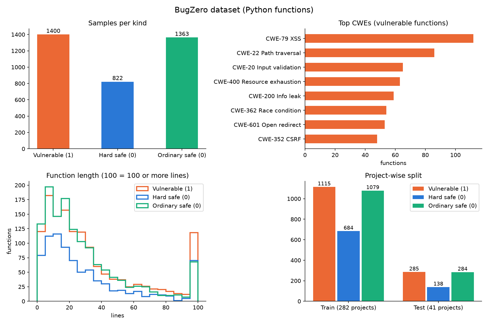

# Dataset: PyVul + ordinary functions (Python)

BugZero's ML model is trained on **PyVul** (MSR 2026), a dataset of real
vulnerabilities found in Python packages. They were collected from GitHub
Security Advisories, Snyk and Huntr, and cleaned with GPT-4. We add ordinary,
untouched functions from the same files as extra safe examples.

The dataset is built by Step 1 of [`ml/training/BugZero_ML.ipynb`](../training/BugZero_ML.ipynb).

## Source files

From https://github.com/billquan/PyVul (downloaded by the notebook):

| File | What it holds |
|---|---|
| `dataset/function_level_dataset.out` | JSON lines, 2,173 records (1,569 Python). Each has `code_before`, `code_after`, `commit` and `other_changed_function_in_the_commit` |
| `dataset/commits_cwe_map.json` | fix commit URL to CWE id, for example `"CWE-79"` |

From GitHub, collected once by [`fetch_ordinary_functions.py`](fetch_ordinary_functions.py)
(needs a GitHub token, about 820 API calls):

| File | What it holds |
|---|---|
| `ordinary_functions.csv.gz` | 25,859 functions from 304 projects: for each PyVul fix commit, the functions in the changed `.py` files that the fix did **not** touch, taken from the version **before** the fix. Test files are skipped |

## Three kinds of samples

| Kind | Label | What it is |
|---|---|---|
| vulnerable | 1 | `code_before` of each Python record: the function before the fix |
| hard safe | 0 | `code_after` of the other functions changed in the same fix commit |
| ordinary safe | 0 | untouched functions from the same files (`ordinary_functions.csv.gz`) |

* The fixed copy of the same vulnerable function is **not** used as a safe example.
  It is almost identical, and the PyVul paper shows models cannot separate such pairs.
* Code is stripped, empty code is dropped, and exact duplicates are removed
  (vulnerable samples are added first, so they are the ones kept).
* **Why ordinary safe?** With only vulnerable vs hard safe, the model was barely better than
  guessing (ROC-AUC 0.56). Hard safe functions are neighbours of the bug, but in the app
  users upload ordinary code.
* **How ordinary safe is sampled:** any function whose name was changed by *any* fix in
  that project is dropped (it could be vulnerable in another commit). Then, for every
  vulnerable function, we pick one ordinary function from the **same project** with the
  **closest length**. So the model can't win by learning a project's style or the length.

## Result

| | Samples | Vulnerable | Hard safe | Ordinary safe | Projects |
|---|---|---|---|---|---|
| All | 3,585 | 1,400 | 822 | 1,363 | 323 |
| Train | 2,878 | 1,115 | 684 | 1,079 | 282 |
| Test | 707 | 285 | 138 | 284 | 41 |

* **Split:** `StratifiedGroupKFold(n_splits=5, shuffle=True, random_state=42)` on the label,
  grouped by project (repo name, lowercased). The first fold is the test set, so no project
  is in both train and test. Checked with scikit-learn 1.9.1.
* **Top CWEs (vulnerable):** 79 XSS (112), 22 path traversal (86), 20 input validation (65),
  400 resource exhaustion (63), 200 info leak (59), 362 race condition (54),
  601 open redirect (53), 352 CSRF (48).
* **Length:** median 23.5 lines (vulnerable), 20 (hard safe), 21 (ordinary safe).
  Every PyVul sample is a whole function (2,127 start with `def`, 95 with `async def`).
* **512-token limit:** CodeBERT reads at most 512 tokens. After Step 2 collapses extra
  spaces, 18% of functions are still longer and get cut off (39% without collapsing).

## Output

`bugzero_dataset.csv` with columns `code`, `label`, `kind`, `repo`, `commit`, `cwe`, `split`,
and the chart `dataset_overview.png`.

## Known limits

* "Ordinary safe" means "not touched by a known security fix", not "proven safe".
  A few may contain bugs nobody has reported yet.
* `ordinary_functions.csv.gz` reflects GitHub as of October 2026. Deleted or private
  repositories are skipped, so re-running the script later may give slightly different numbers.

## Why this matters

In the PyVul paper, Bandit found only 5.3% of the vulnerabilities (10 of 189 commits)
and produced 323,023 warnings for those 189 samples, about 1,709 per sample.
Static analysis alone misses most real bugs, which is why BugZero adds an ML model.
For reference, the paper's best detector (fine-tuned GPT-3.5 Turbo) reached an F1 of 71.6%.

## Citation

Haowei Quan, Terry Yue Zhuo, Junjie Wang, Xiao Chen, Xinzhe Li, Xiaoning Du.
*An Empirical Study of Vulnerabilities in Python Packages and Their Detection.*
MSR 2026. arXiv:2509.04260.
